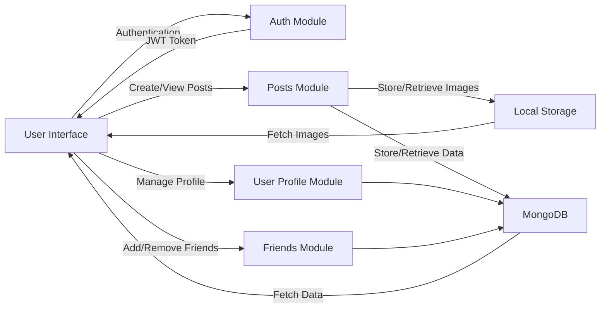

# 🌟 FortiChat - Social Media Platform 🌟

  

Welcome to <strong><em>FortiChat</em></strong>, where Conversations Forge Lasting Connections! 🚀 

   

 Developed with the MERN Stack:

  

   

## Key Features 🌟

| Feature | Description |
| ------- | ----------- |
| **Cyber Security Focus** 🔐 | OWASP Top10 taken intro consideration during development. |
| **Friend System** 👥 | Add or remove friends to build a personalized network. |
| **Posts and Interactions** 💬 | Share thoughts, images, and like other users' posts. |
| **Responsive Design** 📱 | Seamlessly adaptable to various devices, enhancing user accessibility. |
 

# ☢️ Systems Threat Model ☢️

  

## 🌟 Mission Statement for FortiChat 🌟

### Vision 🌐
To create an engaging, secure, and user-friendly social media platform that fosters meaningful connections and community building.

### Mission 🚀
- To develop a comprehensive social media experience that prioritizes user engagement, data security, and a seamless interface. 
- To offer a platform where individuals from diverse backgrounds can connect, share ideas, and foster a sense of community in a safe and welcoming digital environment.

### Core Values 💎
- User-Centric Design 👥
- Privacy and Security 🔒
- Community and Connection 🤝

### Goals 🎯
- To build a robust, scalable social media platform that supports real-time communication, content sharing, and community engagement. 📈
- To implement state-of-the-art security measures, ensuring the integrity and confidentiality of user data. 🛡️
- To continually adapt and grow, responding to user feedback and emerging digital trends to improve the platform. 🌱
 

## 🌍 Project Website Specifications for FortiChat 🌍

| Feature Category | Description |
| ---------------- | ----------- |
| **User Authentication and Registration** 🔑 | - Secure login and registration system.  - Password encryption using bcrypt.  - JWT-based session management. |
| **User Profile Management** 👤 | - Personalized user profiles with editable details like location and occupation.  - Profile picture upload.  - View and manage friends list. |
| **Post Creation and Management** 📝 | - Create posts with text and image content.  - Like and comment on posts.  - Image uploads for posts using multer. |
| **Real-time Feed** 🔄 | - Dynamic feed displaying posts from friends.  - Real-time updates for new content. |
| **Friends System** 👥 | - Add/remove friends to build a personalized network.  - Access control for managing friends list. |
| **Security Features** 🔐 | - Rate limiting to prevent abuse and DoS attacks.  - Input validation and sanitation against XSS and injection attacks.  - Helmet for enhanced HTTP security.  - Generic error responses for security.  - CORS configuration for cross-origin request management. |
| **Database Management** 💾 | - MongoDB with mongoose for database operations.  - Secure database connection handling. |
| **Responsive Design** 📱 | - Adaptable design for accessibility on various devices. |

### Development Approach 🚀

| Aspect | Strategy |
| ------ | -------- |
| **MERN Stack** | Utilization of MongoDB, Express.js, React.js, and Node.js for full-stack development. |
| **Modular Design** | Each feature (authentication, profile management, etc.) is designed as a modular, scalable unit. |
| **API-First Approach** | Backend development with a focus on RESTful API principles for scalability and flexibility. |

  

### Security Considerations 🔒

| Focus | Practices |
| ----- | --------- |
| **OWASP Top 10 Adherence** | Following guidelines for web application security. |
| **Dependency Management** | Regular updates and reviews of dependencies and libraries for security. |
| **Sensitive Data Management** | Use of environment variables to securely manage sensitive data and credentials. |

 

## 🛡️ Assets to Protect in FortiChat 🛡️

Below is a breakdown of these primary assets and the measures in place to protect them.

### User Credentials 🔐
- **Content**: Usernames, email addresses, and passwords.
- **Protection**: Bcrypt for password hashing and secure JWT token management.

### User-Generated Content 📝
- **Content**: Text posts and images shared by users.
- **Protection**: Server-side validation for content integrity.

### Personal User Information 🧑‍💼
- **Content**: User profile data like names, locations, occupations, and profile pictures.
- **Protection**: Secure MongoDB storage, input validation, and sanitation to prevent data leakage and injection attacks.

### Friendship Data 👥
- **Content**: Information about user connections and friendships.
- **Protection**: Access control checks ensuring interactions are confined within the user's network.

### Interactions and Activity Logs 📊
- **Content**: Data on user interactions (likes, comments) and activity logs.
- **Protection**: Access control and rate limiting to prevent unauthorized actions and abuse.

### System Functionality 🖥️
- **Content**: Operational integrity of backend services, APIs, and frontend interactions.
- **Protection**: Helmet for HTTP security, CORS configurations, and consistent error handling.
 

## 📊 Data Flow Chart 📊

- **User Interface 🖥️**: The point of interaction for users, including login, post creation, profile management, and friend system.
- **Auth Module 🔑**: Handles user authentication, generating and validating JWT tokens.
- **Posts Module ✍️**: Manages the creation and retrieval of posts, interfacing with both AWS S3 for image storage and MongoDB for text content.
- **User Profile Module  👤**: Manages user profile information, storing and retrieving data from MongoDB.
- **Friends Module 👥**: Handles the addition and removal of friends, updating the friend list in MongoDB.
- **Local Storage 💾**: Responsible for the storage and retrieval of image files uploaded by users as part of their posts or profile pictures.
- **MongoDB 🗄️**: The primary database for storing user data, posts, and other relevant information.
 

## 🦠 Threats to FortiChat 🦠

### 🔓 Unauthorized Access
- **How/Why:** Could occur through stolen credentials or token leakage, granting attackers access to user accounts or administrative interfaces.

### 🔄 Cross-Site Request Forgery (CSRF)
- **How/Why:** Possible if attackers trick users into submitting requests to the web application where they are authenticated.

### 🚨 Data Breach or Leakage
- **How/Why:** Might result from inadequate database security, leading to unauthorized access to sensitive user data.

### 💉 Injection Attacks
- **How/Why:** Occurs when untrusted data is sent to an interpreter within a command or query, potentially leading to SQL, NoSQL, or JavaScript injection.

### ⏱️ Denial of Service (DoS) Attacks
- **How/Why:** Can happen when services are overwhelmed, making the application unresponsive.

### ⚠️ Cross-Site Scripting (XSS)
- **How/Why:** If the application includes untrusted data without proper validation, attackers could execute scripts in users' browsers.

### 🎣 Man-in-the-Middle (MitM) Attacks
- **How/Why:** Potential risk during data transmission, where attackers intercept and alter communications.

### 🔓 Broken Access Control
- **How/Why:** Occurs when user access limitations are not properly enforced.

### 📤 File Upload Vulnerabilities
- **How/Why:** A risk if users are allowed to upload files without stringent size, type, or content checks.

### 🔧 Misconfiguration and Outdated Software
- **How/Why:** Arises due to improper configuration or failure to update software, exposing vulnerabilities.

### 🕵️ Insider Threats
- **How/Why:** Happens when someone with legitimate access misuses it, impacting the application's security.

### 🗨️ Social Engineering and Phishing
- **How/Why:** Occurs when attackers deceive users into revealing sensitive information or compromising security.
 

## 🌍 Risk Assessment and Prioritization 🌍
- **High Risk:** 
    - Social Engineering and Phishing - reliant on user awareness.
- **Medium Risk:** 
    - Insider Threats - potential access to critical functionalities.
    - XSS - if not specifically mitigated.
- **Low Risk:** 
    - Unauthorized Access, Data Breach, Injection Attacks, DoS, Broken Access Control, File Upload Vulnerabilities, Misconfiguration and Outdated Software - covered by existing security measures.
 

## 🚨 Plan for Incident Response 🚨

### 1. 🕵️ Detection and Identification
- **Monitoring:** Utilize tools like morgan & winston for continuous monitoring of activities.
- **Alerts:** Set up automated alerts for suspicious activities signaling potential incidents. *(WIP)*
- **User Reporting:** Encourage users to report any unusual activities or security concerns.

### 2. 🛡️ Containment
- **Immediate Response:** Quickly isolate affected systems to halt further spread.
- **Backup:** Regular backups to maintain data integrity and assist in recovery.

### 3. 🧹 Eradication
- **Root Cause Analysis:** Investigate to find the cause, examining logs, user activities, and system changes.
- **Remediation:** Address the root cause to remove the issue, potentially involving software patches or security updates.

### 4. 💻 Recovery
- **Restoration:** Carefully restore services, monitoring for signs of recurrence.
- **Testing:** Conduct extensive testing to ensure the issue is fully resolved and systems are functioning normally. *(WIP)*

### 5. 📊 Post-Incident Activities
- **Review and Analysis:** Conduct a thorough review of the incident and the response effectiveness.
- **Documentation:** Document the incident, response actions, and insights for future reference.
- **Communication:** Keep all relevant parties informed about the incident and the measures taken.
- **Training and Improvements:** Update training and security measures based on the incident's learnings.
 

# ⚔️ Cyber Security Measures ⚔️

  

FortiChat is built by taking the [OWASP API Security Top 10](https://owasp.org/API-Security/editions/2023/en/0x11-t10/) into careful consideration.

## API1: Broken Object Level Authorization 🛡️
- **VerifyToken Middleware:** Ensures authentication across routes.
- **Validation Checks:** Users can only access or modify their own data.
- **ObjectId Validation:** Maintains data integrity and prevents unauthorized access.

## API2: Broken Authentication 🔒
- **JWT and Bcrypt:** Manages user sessions and password hashing securely.
- **JWT Token Management:** Securely managed with appropriate expiration.
- **Brute Force Protection:** Implemented loginLimiter to guard against brute force attacks.
- **Extra Validation Layers:** Added validateLoginData & validateRegistrationData middleware.

## API3: Broken Object Property Level Authorization 🚫
- **Data Validation:** Implemented using Joi and other validation middleware.
- **Data Sanitation:** Prevents excessive data exposure.

## API4: Unrestricted Resource Consumption ⚠️
- **Rate Limiting:** Mitigates DDoS and prevents API resource abuse.

## API8: Security Misconfiguration ⚙️
- **Helmet:** Sets various HTTP security headers.
- **CORS Settings:** Configured to manage cross-origin requests.
- **Generic Error Messages:** Avoids disclosing sensitive information.
- **Validation Checks:** Rate limiting and parameter validations for security.

## API9: Improper Inventory Management 📚
- **Documented Endpoints:** API endpoints are well-documented and monitored.
- **Clean Routing:** Unused or debug routes removed for production.

## File Upload Handling 📤
- **Multer Integration:** Manages file uploads securely.
- **Configuration Limits:** Limits file size and type for secure storage.

## Logging and Monitoring 📊
- **Morgan & Winston:** Used for logging HTTP requests and errors.
- **Security Monitoring:** Aids in detecting and responding to threats.

## Error Handling 💥
- **Generic Error Handlers:** Avoids revealing sensitive application or server details.

## Database Connection 🔗
- **Secure MongoDB Connection:** With proper authentication and encryption.
- **Public Access Restriction:** Ensures database security.

## Environment Variables 🌍
- **Dotenv Management:** Keeps sensitive data like JWT secrets secure.

## Overall Security Practices 🛠️
- **Regular Updates:** Addresses vulnerabilities in dependencies and libraries.
 

# 🗃️ Database 🗃️
WIP

  
### Project Setup
- wip
